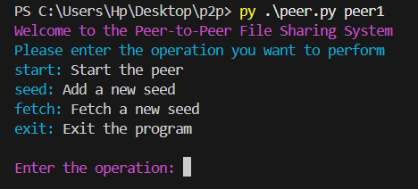
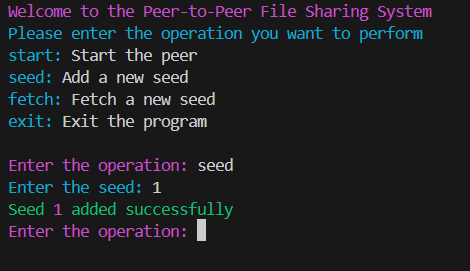
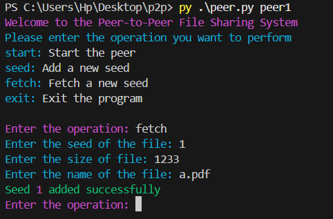

# P2P (Peer-to-Peer File Sharing System)

This project implements a basic peer-to-peer (P2P) file sharing system using Python and sockets. Peers can join a distributed network, share files, and request files from other peers.

## Features

- Peer registration and deregistration with a central tracker.
- File sharing between peers using TCP.
- Tracker maintains metadata about all available peers and their files.
- Dynamic peer discovery and communication.
- CLI-based interaction.
- Use Threading for each individual peer
- Enhanced Security through Data encryption

## Architecture

The system consists of:

- **Tracker**: Maintains a directory of active peers and the files they share.
- **Peer**: Connects to the tracker, registers itself, and can request/download files from other peers.

## Project Structure

- tracker.py # Tracker Side Implementation
- peer.py # Peer Side Implementation
- README.md # Project documentation


## How to Run

### 1. Start the Tracker Side

```bash
py tracker.py
```
This starts the tracker server

### 2. Start the Peer Side

```bash
py peer.py $folderName$
```

This will start the peer with the specify folder name.
The folder argument is necessary.

On doing this you should get the following prompt.




### 3. Peer operations

The operations will do the following functionality:-

**start** :- start the file transfer process. (Note: before you start you should have loaded the seed or leech information beforehand).

**seed** :- To seed the file you have to select the seed operation.



it will ask the seed and a dialog box will ask you to select the file you want to seed.

**fetch** :- to fetch the file you want to download you have to select the fetch operation.



Here you have to enter:
- seed of the file you want to download.
- size of that file (in bytes).
- the name of the output file(need not be same as the download file).

**exit** :- to exit the program gracefully.

## Requirements

Python 3.6+

Python libraries 
-**socket** (for network communication)
-**threading** (For managing threads)
-**tkinter** (for dialog box)
-**colorama** (for color text in terminal)
-**cryptography** (for encryption)

Use this command to install necessary libraries

```bash
pip install  requirements.txt
```


